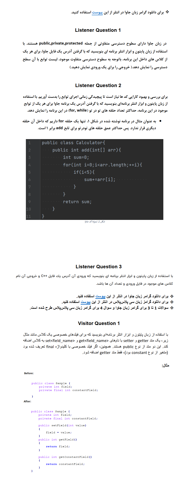

# **🅰️ Compiler Design ANTLR4 Project | پروژه طراحی کامپایلر ANTLR4**

**A university project in which several questions are answered using ANTLR4 and Python.**

**یک پروژه دانشگاهی که در با استفاده از ANTLR4 و پایتون چند سوال پاسخ داده می‌شود.**

# 💬 **نکات پروژه**

* برای اجرا برنامه، به پایتون بالاتر از نسخه 3.6 نیاز دارید.
* گزارش و عکس‌های برنامه در دایرکتوری Report قرار دارد، همچنین برای نصب نرم افزارهای مورد نیاز، آن را مطالعه کنید.
* کتابخانه‌های مورد نیاز در فایل requirements.txt قرار دارند.
* برای دسترسی به همه‌ی پروژه‌های دانشگاهی من، به این لینک مراجعه کنید:

👈🏻 **[پروژه‌های دانشگاهی من](https://github.com/bestmahdi2/Uni__Bachelors_SKU_Path)**

# 📝 **توضیحات پروژه**

